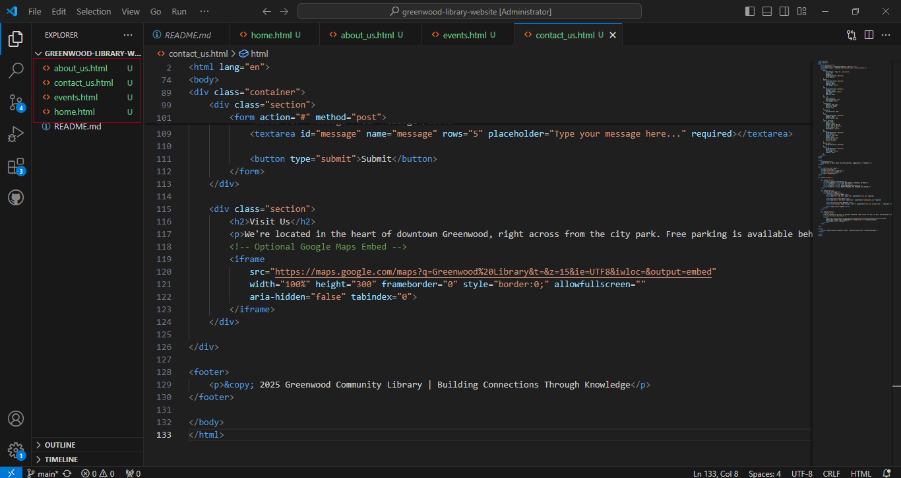

# Enhacing a Community Library website
A step-by-step procedure to complete the scenario for enhancing the Greenwood Community Library website, simulating the roles of Morgan and Jamie, and practicing collaborative Git workflows.
#
# SETUPS:
### 1. Create and Clone the GitHub Repository
```
got clone https://github.com/Ofrelex/greenwood-library-website.git
```

```
cd greenwood-library-website
code .
```

#
## BASE WEBSITE SETUP (MAIN BRANCH)
### 2. Create Base HTML Files
In VS Code, create the following files:

* home.html

* about_us.html

* events.html

* contact_us.html

Add random placeholder content in each file (e.g., headers, paragraphs).


### 3. Stage, Commit, and Push to Main
```
git add .
git commit -m "Add base HTML files for main sections"
git push origin main
```


#
# MORGAN’S TASK: Add Book Reviews Section
### 1. Create and Switch to a New Branch
```
git checkout -b add-book-reviews
```

#
### 2. Add book_reviews.html
Create a new file: book_reviews.html

Add random content:
```
<h1>Book Reviews</h1>
<p>This section contains reviews of popular books from our community.</p>
```

#
### 3. Stage, Commit, and Push
```
git add book_reviews.html
git commit -m "Add book reviews section"
git push origin add-book-reviews
```


#
### 4. Create Pull Request on GitHub
Go to GitHub

* Click "Compare & pull request" for add-book-reviews → main

* Add title: “Add Book Reviews Section”

* Click “Create Pull Request”

* Merge the PR once approved.


#
### 5. Pull Merged Changes Locally
```
git checkout -b update-events
```


#
### 2. Update events.html
Edit the file with updated info, e.g.:
```
<h1>Upcoming Community Events</h1>
<ul>
  <li>Book Club - June 15</li>
  <li>Storytime for Kids - June 20</li>
  <li>Author Visit - July 5</li>
</ul>
```

#
### 3. Stage and Commit Changes
```
git add events.html
git commit -m "Update events page with upcoming community events"
```


#
### 4. Pull Latest Changes from Main
```
git pull origin main
```
If there's a conflict, resolve it manually in events.html, then:
```
git add events.html
git commit -m "Resolve merge conflict in events page"
```


#
### 5. Push and Create Pull Request
```
git push origin update-events
```
* On GitHub: Open a Pull Request from update-events → main
* Title: “Update Events Page”
* Create and merge PR


#
## FINAL STEP: Sync Local Main
```
git checkout main
git pull origin main
```


